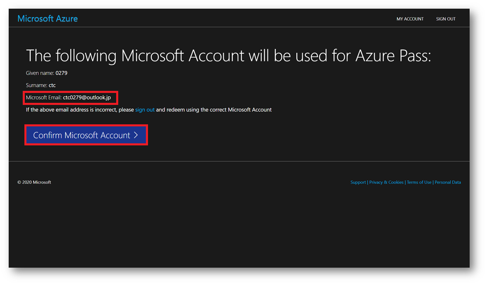

---
lab:
    title: '00 - 事前準備'
    module: 'モジュール 00 - はじめに'
---

# ラボ 00 - 演習用アカウントの準備(10分)

# 受講生用ラボ マニュアル

## ラボ シナリオ

本作業は Azure上の演習で必要な「**Microsoft アカウント**」と「**サブスクリプション**」を 準備する作業となります。

演習前に以下の手順を実施してください。

## 目標

このラボでは次の内容を準備します。

+ タスク 1: Microsoft アカウントのサインイン確認
+ タスク 2: サブスクリプションのアクティベート

------

#### タスク 1: Microsoft アカウントのサインイン確認

このタスクでは、事前に用意したMicrosoftアカウントにサインインできるか確認をします。

1. [https://account.microsoft.com](https://account.microsoft.com) にアクセスし、講師から指示された ID とパスワードで サインインし、正常にログインできるか確認してください。 

    なお、Microsoft アカウントの ID は講師よりチャットまたは PDF で提供されます。

    > **注**:途中でアカウントのロックを解除するために認証コードを携帯電話に送信するよう指示されることが あります。
    >
    > 　 その場合はお手数となりますが、お手持ちの携帯電話番号の入力をお願いいたします。

    
    
    | 設定                  | 値                 |
    | --------------------- | ------------------ |
    | Microsoftアカウント名 | ctcXXXX@outlook.jp |
    | パスワード            | Pa55w.rd1234       |

#### タスク 2: サブスクリプションのアクティベート

このタスクでは、前のタスクで確認したMicrosoftアカウントに、サブスクリプションを関連付けします。

1. [https://www.microsoftazurepass.com](https://www.microsoftazurepass.com ) にアクセスしてください。

1. 「**Start**」をクリックし、Microsoft アカウント(ctcXXXX@outlook.jp)でサインインします。

    

    ------

    **【要注意】**

    「**Microsoft Email: ctcXXXX@outlook.jp**」が必ず今回の研修で使用するアカウント名に表示されていることを必ず確認してください。

    間違ったアカウントで手順を進めると、 誤ったアカウントに Azure Pass が割り当てられ、演習が使用できません。 

    アカウントが違う場合は画面右上のサインアウトを行い、正しいアカウントで認証してください。

    

    ------

    

1. 「**Confirm Microsoft Account**」を押して、promo code を入力し、「**Claim Promo Code**」を 押してください。

    > **注**:(Promo code は講師よりチャットまたは PDF で提供されます。)

    

1. 入力後、画面が遷移するまで、そのままお待ちください。

1. 画面が切り替わりましたら、以下の項目を入力してください。 入力が完了しましたら「**次へ**」を押してください。

    

    | 設定 | 値 |
    | --- | --- |
    | 国/地域 | **日本** |
    | 名 | **Microsoftアカウント名 数字4桁** |
    | 姓 | **ctc** |
    | 重要な通知用メールアドレス | **ctcXXXX@outlook.jp (ご自身の使用する Microsoft アカウント名)** |
    | 電話                       | **ご自身の電話番号(仕事用/私用いずれも可能)**                |
    | 名の読み方 | **Microsoft アカウント名 数字 4 桁** |
    | 姓の読み方                 | **ctc**                                                      |
    | 郵便番号                   | **102-0071**                                                 |
    | 都道府県                   | **東京都** |
    | 市区町村                   | **千代田区** |
    | 住所                       | **富士見１丁目１１−５** |

1. 「**サブスクリプション契約、オファーの詳細、プライバシーに関する声明に同意します。**」 にチェックを入れ、「**サインアップ**」を押してください。

    

1. 画面が切り替わりましたら、「**このサインアップエクスペリエンスに満足していますか？**」 を評価し、送信を押してください。

    しばらくすると画面が Azure Portal に切り替わります。

    

1. Azure Portal の画面に切り替わりましたら、準備完了です。必要に応じて、「ツアーの開始」か「後で行う」を選択してください。

    > **注**:もう一度、ツアーを見る場合は画面右上の「？」アイコンを押して、「ガイド ツアーの起動」 を選択してください。）
    
    

#### レビュー

このラボでは次の内容を準備しました。

- タスク 1: Microsoft アカウントのサインイン確認
- タスク 2: サブスクリプションのアクティベート
