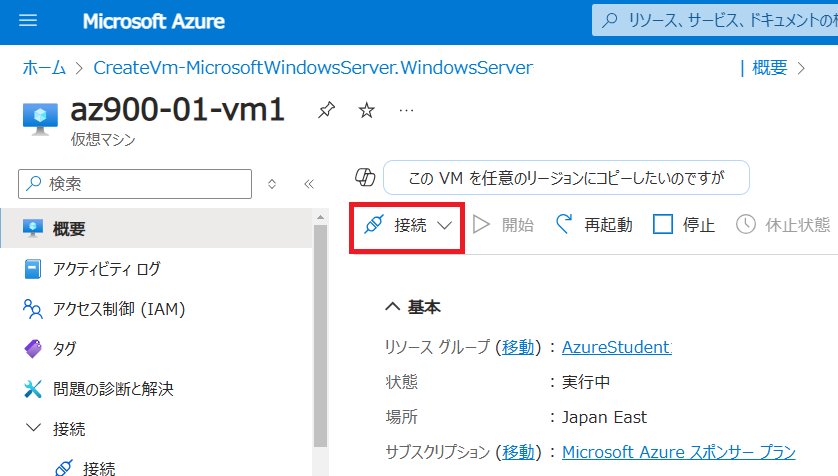

---
wts:
    title: '01 - ポータルで仮想マシンを作成する (15 分)'
    module: 'モジュール 02 - Azure のコア サービス (ワークロード)'
---
# 01 - ポータルで仮想マシンを作成する (20 分)

このチュートリアルでは、Azure portal で仮想マシンを作成し、仮想マシンに接続し、Web サーバー ロールをインストールしてテストします。 

# タスク 1: 仮想マシンを作成する 
1. Azure portal　([https://portal.azure.com](https://portal.azure.com)) にサインインします。

     **※ログイン情報は講師から指示されたものを使用してください。**

2. Azure portalで、「**Virtual Machines**」を検索して選択した後、「**+ 作成**」をクリックします。作成のドロップダウンから「**Azure 仮想マシン**」を選択します。

3. 「**基本**」タブで、次の情報を入力します (特に指定がない情報は、既定値のままで構いません)。

    | 設定 | 値 |
    |  -- | -- |
    | サブスクリプション | **従量課金** |
    | リソース グループ | **アカウントのリソースグループをプルダウンから選択(新規作成はできません)** |
    | 仮想マシン名 | **az900-01-vm1** |
    | 地域 | **(Asia Pacific) 東日本 もしくは Japan East** |
    | 可用性オプション | **インフラストラクチャ冗長は必要ありません** |
    | イメージ | **Windows Server 2022 Datacenter Azure Edition - x64 Gen2** |
    | サイズ | **Standard DS1 v2** |
    | ユーザー名 | **Student** |
    | パスワード | **Pa55w.rd1234** |
    | パブリック受信ポート | **選択したポートを許可する** |
    | 受信ポートの選択 | **RDP (3389)** と **HTTP (80)**|

4.  **「次：ディスク >」** をクリックし、既定値から変更せず **「次：ネットワーク >」** をクリックします。

5.  **「ネットワーク」**  タブでは、 **「受信ポートの選択」** セクションで **HTTP (80) と RDP (3389)** が選択されていることを確認します。

    **※仮想ネットワーク、サブネット、パブリックIP、その他項目は規定値のままで構いません。**

6.  **「次：管理 >」**  をクリックし、既定値から変更せず **「次：監視 >」** をクリックします。

7.    **「監視」** セクションで、 **「ブート診断」** の値を、 **「無効化」** にします。

8. 残りの値は既定値はそのままにして、ページの下部にある **「確認および作成」** をクリックします。

9. 「検証に成功しました」というメッセージが表示されたら、 **「作成」** ボタンをクリックします。仮想マシンをデプロイするには、1～5分かかる場合があります。

10. デプロイ ページ上と **「通知」** 領域 (トップ メニュー バーのベル アイコン) を通して更新を受信します。

# タスク 2: 仮想マシンに接続する

このタスクでは、RDP (リモート デスクトップ プロトコル) を使用して新しい仮想マシンに接続します。 

1. 上部の青いツール バーからベル アイコンをクリックし、展開が成功したら 「リソースに移動」 を選択します。 

    **注**: 「デプロイ」 ページにて「**デプロイが完了しました**」表示後は、 「**リソースに移動**」 リンクを使用することもできます。 

2. 仮想マシンの **「概要」** ブレードで、**「接続」** ボタンをクリックします。

    

    **注**: 次の手順では、Windows コンピューターから VM に接続する方法を説明します。Mac では、Mac App Store にある Remote Desktop Client などの RDP クライアントが必要です。また、Linux コンピューターでは、オープンソースの RDP クライアント ソフトウェアを使用できます。

3. 「**ネイティブRDP**」の項目で「**選択**」のボタンをクリックし、表示されたメニューから「**RDP ファイルのダウンロード**」をクリックしてください。

    
    

4. ダウンロードした RDP ファイルを**開き**、プロンプトが表示されたら 「**接続**」 をクリックします。 

    

5. **「Windows セキュリティ」** ウィンドウで、仮想マシンの作成時に設定した管理者ユーザ名 **「Student」** とパスワード **「 Pa55w.rd1234」**  を使用してサインインします。 

6. サインイン プロセス中に証明書の警告が表示されることがあります。 **「はい」** をクリックして仮想マシン に接続します。正常に接続されるはずです。

    

7. 初回接続時は、 **「Networks」**  と表示されネットワークの接続方法の確認メッセージが表示される場合があります。その際は **「Yes」** をクリックしてください。

   

新しい仮想マシン (az900-01-vm1) に接続されました。サーバー マネージャーのポップアップ表示とダッシュボード ウィンドウが表示されます。 これで、Windows Server を実行している仮想マシンがデプロイおよび接続を確認できました。 

# タスク 3: Web サーバー ロールをインストールしてテストする

このタスクでは、作成した仮想マシンのサーバーに Web サーバーのロールをインストールし、既定の IIS ウェルカム ページが表示されることを確認します。 

1. 前のタスクで接続した仮想マシンで、タスクバーの検索バーより **「PowerShell」** を検索します。検索結果より、**Windows PowerShell**を右クリックして **「管理者として実行(Run as administrator)」** します。

    

2. PowerShell で、次のコマンドを実行して、仮想マシンに **Web サーバー**機能をインストールします。(コピーアンドペーストでコマンドを貼り付け、Enterキーを押してインストールを開始します)。

    ```PowerShell
    Install-WindowsFeature -name Web-Server -IncludeManagementTools
    ```

3. 完了すると、 **「True」**、**「Success」** と表示され、インストールが成功したプロンプトが表示されます。インストールを完了するために仮想マシンを再起動する必要はありません。仮想マシンの上部中央にある青いバーの  **「x」**  をクリックして、仮想マシンへの RDP 接続を閉じます。上部中央の青いバーの  **「-」**  をクリックして最小化することもできます。

    

4. Azure ポータルに戻り、az900-01-vm1の **「概要」** ブレードに移動し、**「クリップボードにコピー」** ボタンを使用してaz900-01-vm1のパブリック IP アドレスをコピーします。新しいブラウザー タブを開いて、パブリック IP アドレスを URL テキスト ボックスに貼り付け、**Enter** キーを押して閲覧します。

    **※画面キャプチャと異なるIPアドレスが割り当てられる場合がありますが、各自に割り当てられたIPアドレスを使用してください。**

    

5. IIS Web サーバーの既定のウェルカム ページが表示されます。

    

パブリック IP アドレスを介してアクセスできる、 Web サーバーが実行された仮想マシンを作成しました。アプリケーション ファイルを仮想マシンにデプロイし、パブリック アクセス可能なWeb アプリケーションをホストできます。

**注**: 追加コストを回避するために、作成したリソースを削除できます。

1. Azure ポータル上部にある検索ボックスで  **「リソースグループ」** を検索します。

2. 検索結果より、演習で使用しているリソースグループ名をクリックします。

3. リソースグループの  **「概要」**  ブレード内にある、リソースの一覧から削除したいリソースを選択し、 **「削除」**  をクリックします。

   

4.   **「リソース削除」**  ブレードで  **「削除の確認」**  ボックス内に  **「はい」**  と入力してから  **「削除」**  をクリックします。

5. リソースがすべて削除されるまでに数分かかります。削除されるのを待たずに次に演習に進んで構いません。

   **※注意※リソースグループそのものを削除すると、演習ができなくなります。削除する時は、リソースグループ内のリソースのみにしてください。**
