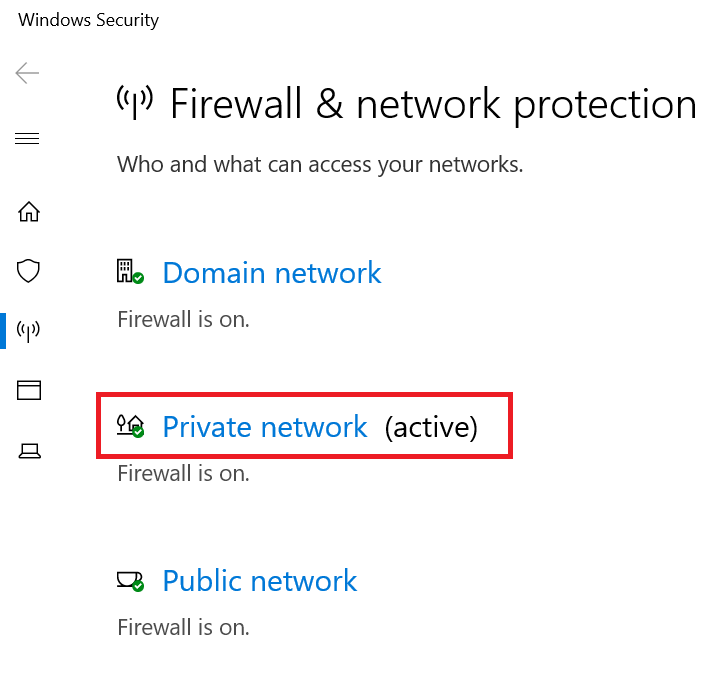
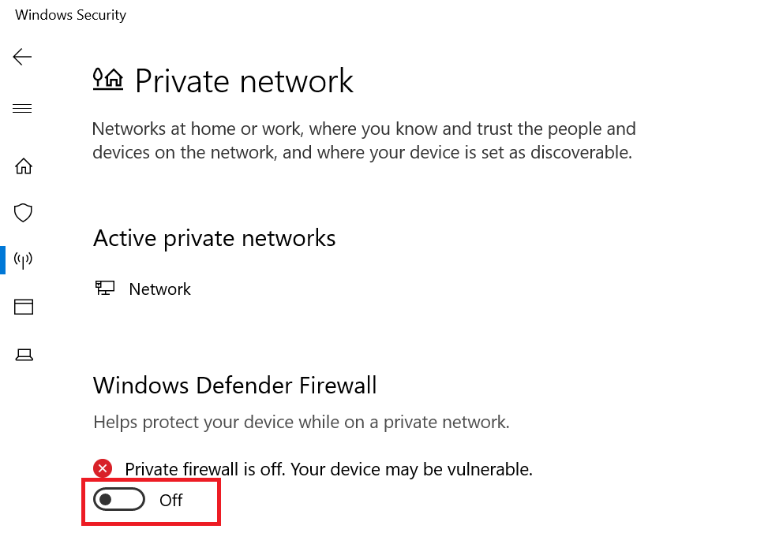

---
wts:
    title: '04 - 仮想ネットワークの作成 (20 分)'
    module: 'モジュール 02 - Azure のコア サービス (ワークロード)'
---
# 04 - 仮想ネットワークの作成 (20 分)

このチュートリアルでは、仮想ネットワークを作成し、その仮想ネットワークに 2 台の仮想マシンをデプロイして、仮想ネットワーク経由で一方の仮想マシンから他方の仮想マシンに ping を実行できるように構成します。

# タスク 1: 仮想ネットワークを作成する 

このタスクでは、仮想ネットワークを作成します。 

1. Azure portal　([https://portal.azure.com](https://portal.azure.com))にサインインします。

    **※ログイン情報は講師から指示されたものを使用してください。**

2. Azure portalで「**仮想ネットワーク**」を検索して選択し、「**+ 作成**」をクリックします。 

3. 「**基本**」タブで、次の情報を入力します (その他の情報は既定値のままにします)。

    | 設定 | 値 |
    | --- | --- |
    | サブスクリプション | **Microsoft Azure - スポンサープラン** |
    | リソース グループ（新規作成） | **アカウントのリソースグループをプルダウンから選択(新規作成はできません)** |
    | 名前 | **vnet1** |
    | 地域 | **East US もしくは 米国東部** |

4. 「**確認および作成**」ボタンをクリックします。検証できたことを確認し、「**作成**」をクリックして仮想ネットワークをデプロイします。


# タスク 2: 2 つの仮想マシンを作成する

このタスクでは、仮想ネットワークに 2 つの仮想マシンを作成します。 

1. Azure portalで「**Virtual Machines**」を検索して選択し、「**+作成**」をクリックしてプルダウンから「**Azure仮想マシン**」を選択します。 

2. 「仮想マシンの作成」ブレードの「**基本**」タブで、次の情報を入力します (特に指示がない項目は、既定値のままにします)。

   | 設定 | 値 |
   | --- | --- |
   | サブスクリプション | **Microsoft Azure - スポンサープラン** |
   | リソース グループ | **アカウントのリソースグループをプルダウンから選択(新規作成はできません)** |
   | 仮想マシン名 | **az900-04-vm1** |
   | 地域 | **(US) East US もしくは米国東部** |
   | イメージ | **Windows Server 2019 Datacenter - Gen2** |
   | ユーザー名| **Student** |
   | パスワード| **Pa55w.rd1234** |
   | パブリック受信ポート| **選択したポートを許可する**  |
   | 受信ポートを選択 | **RDP (3389)** |

3.  **「次：ディスク >」** をクリックし、既定値から変更せず **「次：ネットワーク >」** をクリックします。

4. 「**ネットワーク**」タブでは、仮想マシンが **vnet1** 仮想ネットワークに配置されていることを確認します。既定の設定を確認しますが、他の変更は行わないでください。 

5. 「**確認および作成**」 をクリックします。検証ができたら、 「**作成**」 をクリックします。デプロイにかかる時間は場合により異なりますが、通常 1～5分かかる可能性があります。

6. デプロイの完了を待たず、次の手順に進みます。 

7. 上記の手順 **2~5** を繰り返して、2 番目の仮想マシンを作成します。「**仮想マシン名**」を1番目の仮想マシンと異なる名称にします。

    | 設定                 | 値                                                           |
    | -------------------- | ------------------------------------------------------------ |
    | サブスクリプション   | **Microsoft Azure - スポンサープラン**                       |
    | リソース グループ    | **アカウントのリソースグループをプルダウンから選択(新規作成はできません)** |
    | 仮想マシン名         | **az900-04-vm2**                                             |
    | 地域                 | **(US) East US もしくは米国東部**                            |
    | イメージ             | **Windows Server 2019 Datacenter - Gen2**                    |
    | ユーザー名           | **Student**                                                  |
    | パスワード           | **Pa55w.rd1234**                                             |
    | パブリック受信ポート | **選択したポートを許可する**                                 |
    | 受信ポートを選択     | **RDP (3389)**                                               |

8. Azure portalで「**Virtual Machines**」を検索して選択し、両方の仮想マシンがデプロイされ、「**状態**」が「**実行中**」と表示されるのを待ちます。

    

# タスク 3: 接続をテストする 

このタスクでは、仮想マシンが相互に通信 (ping)できるかどうかをテストします。実施できない場合、ICMP 接続を許可するルールを適用する必要があります。通常、ICMP 接続は自動的にブロックされます。

1. 「**Virtual Machines**」 ブレードで**az900-04-vm1** をクリックし、 **「概要」** ブレードにある「**接続**」 のドロップダウンメニューから **「RDP」** を選択します。

    **注**: 次の手順では、Windows コンピューターから 仮想マシン に接続する方法を説明しています。 

2. 「**接続**」ブレードで、ポート 3389 経由で IP アドレスで接続する既定のオプションを保持し、「**RDP ファイルのダウンロード**」をクリックします。

3. ダウンロードした RDP ファイルを開き、プロンプトが表示されたら 「**接続**」 をクリックします。 

4. 「**Windows セキュリティ**」 ウィンドウで、仮想マシンの作成時に設定した管理者ユーザ名「**Student**」とパスワード「 **Pa55w.rd1234**」 を使用してサインインします。 

5. サインイン プロセス中に証明書の警告が表示されることがあります。「**はい**」をクリックして、仮想マシンに接続します。

6. Azure ポータルの「**Virtual Machines**」 ブレードに戻って**az900-04-vm2** をクリックし、同様にRDP接続を実施します。

7. 新しく作成された**両方**の仮想マシン上で、 **「スタート」メニュー> 「歯車マーク(Settings)」 > 「Network ＆ Internet」　> 「Windows Firewall」** を開いて、Private Network (プライベートネットワーク)をクリックします。

    

8. Windows Defender Firewall のスライダーを無効化 (Off) にします。

    

9.  **「Windows Firewall」** に戻り、 Public network も同様に、Windows Defender Firewall のスライダーを無効化 (Off) にします。

    **※az900-04-vm1、az900-04-vm2の両方の仮想マシンでWindows Defender Firewallを無効化してください。**

10. az900-04-vm1 のRDP接続先のタスクバーの検索ボックスから「**PowerShell**」 を検索します。検索結果より、**Windows PowerShell**を右クリックして「**管理者として実行(Run as administrator)**」します。

11. PowerShell で、次のように入力して az900-04-vm2 に ping を実行してみます。

    ```PowerShell
    ping az900-04-vm2
    ```

12. az900-04-vm1 から az900-04-vm2 への ping が成功するはずです。

     

     **※実行結果のTTLの値が128と返ってくれば成功しています。**


仮想ネットワークに 2 つの仮想マシンをデプロイし、それらを接続することができました。

**注**: 追加コストを回避するために、作成したリソースを削除できます。

1. Azure ポータル上部にある検索ボックスで **「リソースグループ」** を検索します。

2. 検索結果より、演習で使用しているリソースグループ名をクリックします。

3. リソースグループの **「概要」** ブレード内にある、リソースの一覧から削除したいリソースを選択し、 **「削除」** をクリックします。

4. **「リソース削除」** ブレードで **「削除の確認」** ボックス内に **「はい」** と入力してから **「削除」** をクリックします。

5. リソースがすべて削除されるまでに数分かかります。削除されるのを待たずに次の演習に進んで構いません。

   **※注意※リソースグループそのものを削除すると、演習ができなくなります。削除する時は、リソースグループ内のリソースのみにしてください。**
