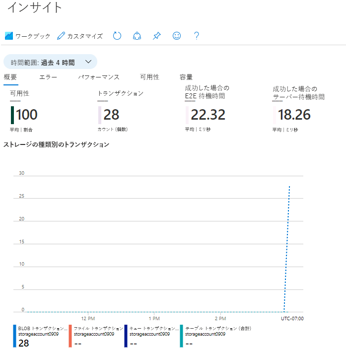

---
wts:
    title: '04 - Blob Storage を作成する (10 分)'
    module: 'モジュール 02 - Azure のコア サービス (ワークロード)'
---
# 04 - Blob Storage を作成する (10 分)

このチュートリアルでは、ストレージ アカウントを作成し、Blob Storage ファイルを操作します。

# タスク 1: ストレージ アカウントを作成する 

このタスクでは、新しいストレージ アカウントを作成します。 

1. Azure portal　([https://portal.azure.com](https://portal.azure.com))にサインインします。

    **※ログイン情報は講師から指示されたものを使用してください。**

2. Azure portalで「**ストレージ アカウント**」を検索して選択し、**「+ 作成」** をクリックします。 

3. 「**ストレージ アカウントの作成**」 ブレードの 「**基本**」 タブで次の情報を入力します (ストレージ アカウントの名前の **xxxx** は、名前がグローバルに一意になるように文字と数字に置き換えます)。その他は既定値のままにします。

    | 設定 | 値 |
    | --- | --- |
    | サブスクリプション | **Microsoft Azure スポンサー プラン** |
    | リソース グループ | **アカウントのリソースグループをプルダウンから選択(新規作成はできません)** |
    | ストレージ アカウント名 | **storageaccountxxxx** |
    | 地域 | **(US) East USもしくは米国東部** |
    | パフォーマンス | **Standard** |
    | 冗長性 | **ローカル冗長ストレージ (LRS)** |

    **注** -  **xxxx** を変更して、一意の **ストレージ アカウント名** となるようにしてください

4.  **「確認および作成(Reviw)」**  をクリックして、ストレージ アカウントの設定を確認し、Azure が構成を検証できるようにします。 

5. 検証できたら、 **「作成」** をクリックしますアカウントが正常に作成されたことを示す通知を待ちます。 

6.  **「ストレージ アカウント」** ブレードに移動し、作成したストレージ アカウントが表示されていることを確認します。

    

# タスク 2: Blob Storage を操作する

このタスクでは、BLOB コンテナーを作成し、BLOB ファイルをアップロードします。 

1.  **「ストレージ アカウント」** ブレードで、前のタスクで作成したストレージアカウントをクリックし、左側のメニューの「**データ ストレージ**」セクションから「**コンテナー**」をクリックします。

   

2.  **「+ コンテナー」** をクリックして、 **「新しいコンテナー」**  ブレードで以下の情報を設定します。完了したら、 **「作成」** をクリックします。

   | 設定                       | 値                                         |
   | -------------------------- | ------------------------------------------ |
   | 名前                       | **container1**                             |
   | パブリック アクセス レベル | **BLOB（BLOB専用の匿名読み取りアクセス）** |

3. 新しいブラウザー ウィンドウを開き、花の画像を検索します。画像を右クリックして デスクトップなどに保存します。

4. Azure portalに戻り、**container1** をクリックして、「**アップロード**」 をクリックします。

5. ローカル コンピューターを参照し、保存した画像ファイルを選択してから、「**アップロード**」 をクリックします。

6. アップロードしたデータをクリックし、 **「概要」** ブレードからURLをコピーします。

   

7. 新しいブラウザー ウィンドウを開き、前の手順でコピーしたURLを検索します。

8. アップロードした画像が表示されることが確認できます。

   

# オプション: ストレージ アカウントを監視する

1. ストレージ アカウント ブレードに戻り、「**問題の診断と解決**」をクリックします。 

2. 一般的なストレージの問題を確認します。複数のトラブルシューティング ツールがあること確認できます。

3. ストレージ アカウントのブレードで、 「**監視**」 セクションまでスクロールして 「**分析情報**」 をクリックします。障害、パフォーマンス、可用性、容量に関する情報があることを確認します。環境によって情報は異なります。

    

**注**: 追加コストを回避するために、作成したリソースを削除できます。

1. Azure ポータル上部にある検索ボックスで **「リソースグループ」** を検索します。

2. 検索結果より、演習で使用しているリソースグループ名をクリックします。

3. リソースグループの **「概要」** ブレード内にある、リソースの一覧から削除したいリソースを選択し、 **「削除」** をクリックします。

4. **「リソース削除」** ブレードで **「削除の確認」** ボックス内に **「はい」** と入力してから **「削除」** をクリックします。

5. リソースがすべて削除されるまでに数分かかります。削除されるのを待たずに次の演習に進んで構いません。

   **※注意※リソースグループそのものを削除すると、演習ができなくなります。削除する時は、リソースグループ内のリソースのみにしてください。**
