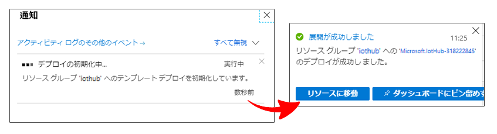
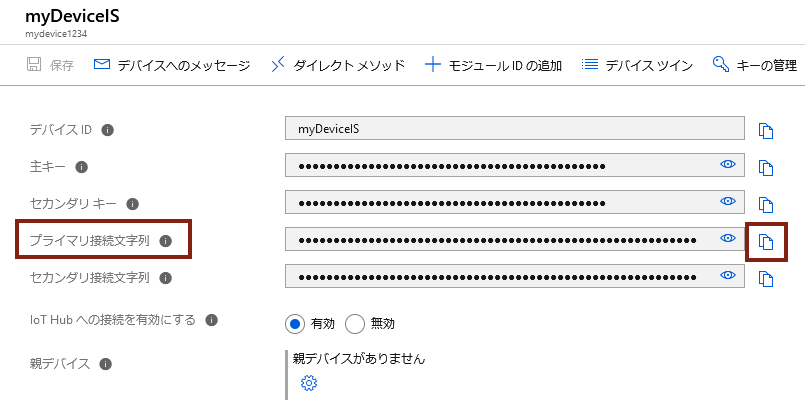

---
wts:
    title: '05 - Azure IoT Hub の実装 (10 分)'
    module: 'モジュール 03: コア ソリューションおよび管理ツールに関する説明'
---
# 05 - Azure IoT Hub の実装 (15 分)

このチュートリアルでは、Azure portal で新しい Azure IoT Hub をセットアップし、Raspberry Piシミュレーターを使用して IoT デバイスとの接続を実装します。センサー データとメッセージが Raspberry Pi シミュレーターから Azure IoT Hub に送信され、Azure portal でメッセージング アクティビティのメトリックを表示します。

# タスク 1: IoT ハブを作成する 

このタスクでは、IoT ハブを作成します。 

1. Azure portal　([https://portal.azure.com](https://portal.azure.com))にサインインします。

    **※ログイン情報は講師から指示されたものを使用してください。**

2. Azure portalで **「IoT Hub」** を検索して選択し、**「+ 作成」** のいずれかをクリックします。

3.  **「IoT ハブ」** ブレードの **「基本」** タブで、フィールドに次の詳細情報を入力します（IoT Hub名の **xxxx** は、名前がグローバルに一意になるように文字と数字に置き換えます）。

    | 設定 | 値 |
    |--|--|
    | サブスクリプション | **Microsoft Azure - スポンサープラン** |
    | リソース グループ | **アカウントのリソースグループをプルダウンから選択(新規作成はできません)** |
    | IoT Hub 名 | **my-hub-groupxxxx** |
    | 領域 | **East USもしくは米国東部** |
    | レベル | **Standard** |
    | 1日あたりのメッセージの制限 | **規定値** |

    **注** -  **xxxx** を変更して、一意の **IoT Hub 名** となるようにしてください。(例 : 日付と演習番号の組み合わせなど)

4.  **「確認および作成」** ボタンをクリックし、検証が完了したら **「作成」**  ボタンをクリックして、Azure IoT Hub インスタンスの作成を開始します。

5. Azure IoT Hub インスタンスがデプロイされるまで待ちます (デプロイ完了までに数分かかります)。

# タスク 2: IoT デバイスを追加する

このタスクでは、IoT デバイスを IoT ハブに追加します。 

1. デプロイが完了したら、デプロイ ブレードで  **「リソースに移動」** をクリックします。または、Azure portalで **「IoT Hub」** を検索して選択し、新しい IoT Hub インスタンスを特定します

	

2. 新しい IoT デバイスを追加するには、 **「デバイス管理」** セクションにスクロールして、 **「デバイス」**  をクリックします。次に、**「+ デバイスの追加」** をクリックします。

	

3.  **「デバイス ID」** に  **「myRaspberryPi」** と入力し、 **「保存」** をクリックします。これにより、Azure IoT Hub に新しい IoT デバイス ID が作成されます。

4. 新しいデバイスが表示されない場合は、 **「最新の情報に更新」** をクリックします。 

5.  **「myRaspberryPi」** を選択し、 **「プライマリ接続文字列」** の値をコピーします。次のタスクでこのキーを使用して、Raspberry Pi シミュレーターとの接続を認証します。

	

# タスク 3: Raspberry Pi シミュレーターを使用してデバイスをテストする

このタスクでは、Raspberry Pi シミュレーターを使用してデバイスをテストします。 

1. Web ブラウザーで新しいタブを開き、このショートカット リンク [https://aka.ms/RaspPi](https://aka.ms/RaspPi) を入力します。Raspberry Pi シミュレーター サイトに移動します。

   ※ **「Raspberry Pi Web シミュレーターの概要」** という画面が表示されたら、右上の **「 × 」** をクリックして閉じて構いません。

   

2. 画面右側に表示されるコードから、 **「const connectionString =」** と書かれた行を確認します。(15行目前後にあります。) **「HostName=～」** の部分を前のタスクでIoT Hub上からコピーした接続文字列で置換します。接続文字列には DeviceId (**myRaspberryPi**) と SharedAccessKey のエントリが含まれます。

  

3.  **「Run」** （コード エリアの下）をクリックして、コードを実行します。コンソール出力に、Raspberry Pi シミュレーターから Azure IoT Hub に送信されているセンサー データとメッセージが表示されます。データとメッセージは、Raspberry Pi シミュレーターのLEDが点滅するたびに送信されます。 

  

4.  **「Stop」** をクリックするとデータ送信が停止します。

5. Azure portal に戻ります。

6. IoT Hub の **「概要」** ブレードに切り替え、 **「IoT Hub 使用状況」** 情報にスクロールして、使用状況を表示します。過去 1 時間のデータを表示するには、**最後の表示データ**の時間枠を変更します。

  ※使用状況が反映されるまでにタイムラグがあります。使用状況が確認できない場合は、ブラウザ更新をしてください。

  

これでIoT デバイスからセンサー データを収集するように Azure IoT Hub をセットアップできました。

**注**: 追加コストを回避するために、作成したリソースを削除できます。

1. Azure ポータル上部にある検索ボックスで **「リソースグループ」** を検索します。

2. 検索結果より、演習で使用しているリソースグループ名をクリックします。

3. リソースグループの **「概要」** ブレード内にある、リソースの一覧から削除したいリソースを選択し、 **「削除」** をクリックします。

4. **「リソース削除」** ブレードで **「削除の確認」** ボックス内に **「はい」** と入力してから **「削除」** をクリックします。

5. リソースがすべて削除されるまでに数分かかります。削除されるのを待たずに次の演習に進んで構いません。

   **※注意※リソースグループそのものを削除すると、演習ができなくなります。削除する時は、リソースグループ内のリソースのみにしてください。**
