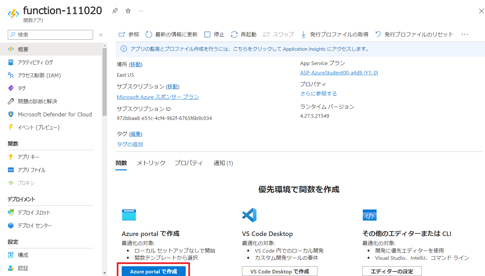
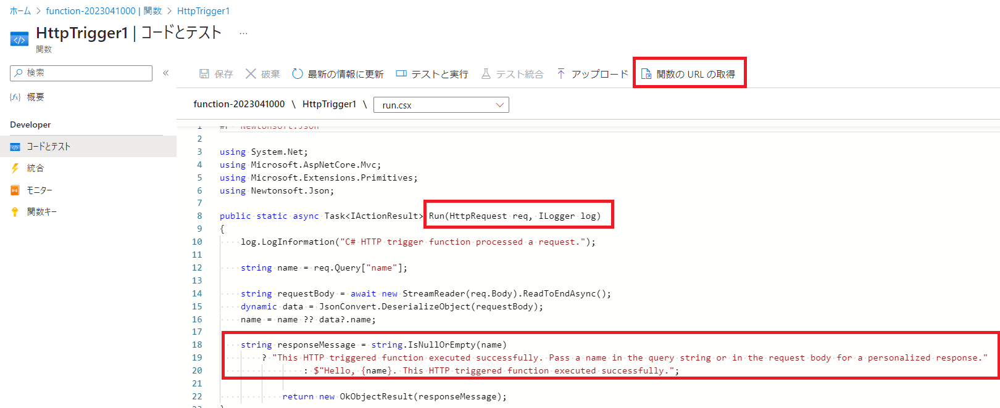
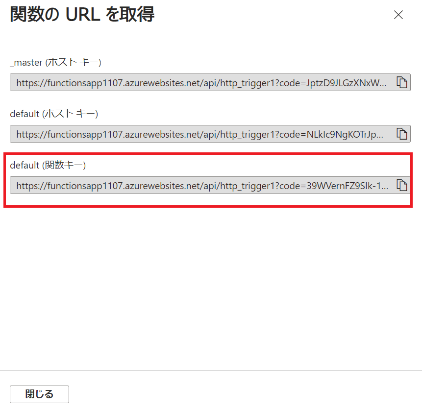

---
wts:
    title: '06 - Azure Functions の実装 (15 分)'
    module: 'モジュール 03: コア ソリューションおよび管理ツールに関する説明'
---
# 06 - Azure Functions の実装 (15 分)

このチュートリアルでは、HTTP 要求がある場合に Hello メッセージを表示する関数アプリを作成します。 

# タスク 1: 関数アプリを作成する 

このタスクでは、関数アプリを作成します。

1. Azure portal　([https://portal.azure.com](https://portal.azure.com))にサインインします。

    **※ログイン情報は講師から指示されたものを使用してください。**

2. Azure portalで **「関数アプリ」** を検索して選択し、 **「関数アプリ」** ブレードで **「+ 作成」** をクリックします。

    

3. **「関数アプリ」** ブレードの **「基本」** タブで次の設定を指定します（関数アプリ名の **xxxx** は、名前がグローバルに一意になるように文字と数字に置き換え、以下に指示がない設定は、既定値のままにしておきます）。

    | 設定 | 値 |
    | -- | --|
    | サブスクリプション | **従量課金** |
    | リソース グループ | **アカウントのリソースグループをプルダウンから選択(新規作成はできません)** |
    | 関数アプリ名 | **function-xxxx** |
    | 公開 | **コード** |
    | ランタイム スタック | **.NET** |
    | バージョン | **6(LTS)** |
    | 地域 | **East USもしくは米国東部** |

4. **「確認および作成」** をクリックし、検証が完了したら **「作成」** をクリックして、Azure 関数アプリのデプロイを開始します。

5. リソースが作成されたことを示す通知を待ちます。

6. デプロイが完了したら、デプロイ ブレードで  **「リソースに移動」**  をクリックします。または、 **「関数アプリ」** ブレードに戻り、 **「更新」** をクリックして、新しく作成した関数アプリの状態が **「実行中」** であることを確認します。 

    

    

# タスク 2: HTTP トリガー関数を作成してテストします。

このタスクでは、Webhook + API 関数を使用して、HTTP 要求がある場合にメッセージを表示します。 

1. **「関数アプリ」** ブレードで、新しく作成した関数アプリをクリックします。 

2. **「概要」** ブレードで下にスクロールし、 **「関数」** タブで **「Azure portal で作成」** をクリックします。

    

    

3. **「関数の作成」** ウィンドウが右側に表示されます。 **「テンプレートの選択」** セクションで、 **「HTTP trigger」** を選択して **「作成」** をクリックします 

    ![Azure Portal 内のドット ネットの [はじめに] ペインの Azure Functions で関数を作成する手順のスクリーンショット。Azure Functions に新しい webhook を追加するために使用する表示要素を示す HTTP トリガー カードが強調表示されます。](./images/0702a.png)

4. **「HttpTrigger1」** ブレードを表示し、 **「Developer」** セクションで、 **「コード と テスト」** をクリックします。

    ※  **「HttpTrigger1」** が表示されない場合は、ブラウザ更新をしてください。

5. **「コード と テスト」** ブレードで、自動で生成されたコードを確認し、コードが HTTP 要求に対する応答とログ出力を実行する内容であることを確認します。また、この関数は任意の名称と Hello メッセージを返します。 

    

6. 関数エディターの上部セクションで「**関数の URL の取得**」をクリックします。 

7. 「**キー**」ドロップダウン リストの値が「**default**」となっていることを確認し、「**コピー**」をクリックして関数の URL をコピーします。 

    

8. 新しいブラウザー タブを開いて、コピーした関数の URL を Web ブラウザーのアドレス バーに貼り付けます。ページが要求されると、関数を実行します。返されるメッセージには、関数に要求本文内の名前が必要であることが表示されます。

    

9. URL の末尾に **&name=*yourname*** を追加します（**yourname**の部分を任意の名称に変更してください）。

    **注**: たとえば、名前が Cindy の場合、最終的な URL は次のようになります。 `https://function-xxxx.azurewebsites.net/api/HttpTrigger1?code=X9xx9999xXXXXX9x9xxxXX==&name=cindy`

    

10. 「関数アプリ」 ブレードの 「概要」 ブレードに戻ると、関数の実行回数等が確認できます。

    

HTTP 要求がある場合に Hello メッセージを表示する関数アプリを作成できました。 

**注**: 追加コストを回避するために、作成したリソースを削除できます。

1. Azure ポータル上部にある検索ボックスで **「リソースグループ」** を検索します。

2. 検索結果より、演習で使用しているリソースグループ名をクリックします。

3. リソースグループの **「概要」** ブレード内にある、リソースの一覧から削除したいリソースを選択し、 **「削除」** をクリックします。

4. **「リソース削除」** ブレードで **「削除の確認」** ボックス内に **「はい」** と入力してから **「削除」** をクリックします。

5. リソースがすべて削除されるまでに数分かかります。削除されるのを待たずに次の演習に進んで構いません。

   **※注意※リソースグループそのものを削除すると、演習ができなくなります。削除する時は、リソースグループ内のリソースのみにしてください。**
