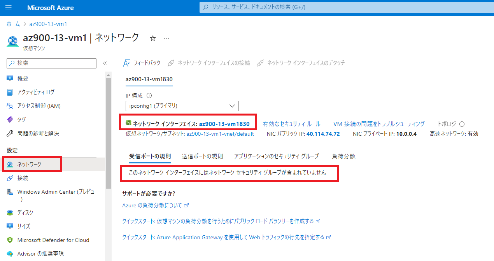

---
wts:
    title: '07 - セキュリティ保護されたネットワーク トラフィック (20 分)'
    module: 'モジュール 04: 一般的なセキュリティ機能およびネットワーク セキュリティ機能に関する説明'
---
# 07 - セキュリティ保護されたネットワーク トラフィック (25 分)

このチュートリアルでは、ネットワーク セキュリティ グループを作成します。

# タスク 1: 仮想マシンを作成する

このタスクでは、Windows Server 2022 Datacenter 仮想マシンを作成します。 

1. Azure portal　([https://portal.azure.com](https://portal.azure.com))にサインインします。

    **※ログイン情報は講師から指示されたものを使用してください。**

2. Azure portalで **「Virtual Machines」** を検索して選択し、 **「+ 作成」** をクリックして **「Azure 仮想マシン」** を選択します。

3. **「基本」** タブで、次の情報を入力します (以下に指示がない項目の情報は既定値のままにします)。

    | 設定 | 値 |
    |  -- | -- |
    | サブスクリプション | **従量課金** |
    | リソース グループ | **アカウントのリソースグループをプルダウンから選択(新規作成はできません)** |
    | 仮想マシン名 | **az900-07-vm1** |
    | 地域 | **(Asia Pacific) Japan East** |
    | 可用性オプション | **インフラストラクチャ冗長は必要ありません** |
    | イメージ | **Windows Server 2022 Datacenter: Azure Edition - x64 Gen 2** |
    | サイズ | **Standard D2s v3（すべてのサイズを表示して選択）** |
    | ユーザー名（管理者アカウント） | **Student** |
    | パスワード（管理者アカウント） | **Pa55w.rd1234** |
    | パブリック受信ポート | **なし**|

4. **「次：ディスク >」** でディスクに関する設定を確認し、既定の値のまま **「次：ネットワーク >」** をクリックして **「ネットワーク」**  タブに切り替えます。次の設定を構成します。

    | 設定 | 値 |
    | -- | -- |
    | NIC ネットワーク セキュリティ グループ | **なし**|

5. **「次：管理 > 」** をクリックして、Azure VM に関する監視の設定を確認したら、既定値のまま **「次: 監視 > 」** をクリックします。 

6. **「診断」** セクションで次の設定を選択します。

    | 設定 | 値 |
    | -- | -- |
    | ブート診断 | **無効化** |

7. その他の既定値はそのままにして、ページの下部にある **「確認および作成」** ボタンをクリックします。

8. 検証が完了したら、**「作成」** ボタンをクリックします。仮想マシンのデプロイには約 5 分かかる場合があります。

9. デプロイ ブレードまたは通知領域から、**「リソースに移動」** をクリックします。 

10. **「az900-07-vm1」** 仮想マシンブレードで、 **「ネットワーク」** セクションの **「ネットワーク設定」** をクリックし、**「表示するポート ルールがありません」** と表示されていることを確認します。これは仮想マシンのネットワーク インターフェイスまたはネットワーク インターフェイスが接続されているサブネットに、ネットワーク セキュリティ グループが関連付けられていない状態を示しています。

11. 前の手順と同じ画面上でネットワーク インターフェイスの名前を特定します。この名前は、次のタスクで必要になります。

     > 注：下記の項目が表示されない場合があります。「設定」セクションの「ネットワーク」から同様にネットワークインターフェイスの状態が表示できますので、そちらの画面を使用してネットワークセキュリティグループの関連付けがないことを確認してください。

     

# タスク 2: ネットワーク セキュリティ グループを作成する

このタスクでは、ネットワーク セキュリティ グループを作成し、ネットワーク インターフェイスに関連付けます。

1. Azure ポータルで、**「ネットワーク セキュリティ グループ」** を検索して選択し、**「+ 作成」** をクリックします。

2. **「ネットワークセキュリティグループの作成」** ブレードの **「基本」** タブで、次の設定を指定します。

    | 設定 | 値 |
    | -- | -- |
    | サブスクリプション | **従量課金** |
    | リソース グループ | **アカウントのリソースグループをプルダウンから選択(新規作成はできません)** |
    | 名前 | **az900-07-nsg1** |
    | 地域 | **Japan East** |

3. **「確認および作成」** をクリックし、検証完了後、**「作成」** をクリックします。

4. デプロイが完了したら、**「リソースに移動」** をクリックします。

5.  **「設定」** セクション の  **「ネットワーク インターフェイス」**  をクリックし、 **「関連付け」** をクリックします。

6. 前のタスクで特定したネットワーク インターフェイスをプルダウンから選択して、 **「OK」** をクリックします。 

# タスク 3: RDP を許可する受信セキュリティ ポートの規則を構成する

このタスクでは、受信セキュリティ ポートの規則を構成して、仮想マシンに RDP トラフィックを許可します。 

1. Azure portal で **「Virtual Machines」** を検索して選択し、 **「az900-07-vm1」** 仮想マシンのブレードに移動します。 

2. **「概要」** ブレードで **「接続」** をクリックして接続ブレードに移動し、 **「ネイティブRDP」** を選択してRDPファイルをダウンロードします。

3. ダウンロードされたRDPファイルを使って仮想マシンへの接続を試みます。ネットワーク セキュリティ グループの既定のルールで RDP は許可されていないため、次のようなエラーメッセージが表示されます。エラー ウィンドウを閉じます。 

   

4. 仮想マシンのブレードで **「ネットワーク」** セクションまでスクロールし、**「ネットワーク設定」** をクリックして、ネットワーク セキュリティ グループ **「ネットワークセキュリティグループaz900-07-nsg1 (ネットワーク インターフェイスにアタッチ済み: az900-07-vmxxxx)」** の**受信ポートのルール**で、仮想ネットワーク内のトラフィックとロードバランサーを除くすべての受信トラフィックを拒否していることを確認します。

5. **「ポートルールの追加」**から**「受信ポートルール」** を選択して以下の設定を入力します。完了したら、**「追加」** をクリックします。 

    | 設定 | 値 |
    | -- | -- |
    | ソース | **Any** |
    | ソースポート範囲 | **\*** |
    | 宛先 | **Any** |
    | サービス | **RDP** |
    | 宛先ポート範囲 | **3389(グレーアウトされています)** |
    | プロトコル | **TCP(グレーアウトされています)** |
    | アクション | **許可** |
    | 優先度 | **300** |
    | 名前 | **AllowRDP** |

6. ルールが適用されるのを待ってから、 **「接続」** に戻って仮想マシンへの RDP を再試行します。今回は成功するはずです。ユーザーは **「Student」** で、パスワードは **「Pa55w.rd1234」** です。RDP接続は切らずに次のタスクへ移ります。

# タスク 4: インターネット アクセスを拒否するように送信セキュリティ ポートの規則を構成する

このタスクでは、インターネット アクセスを拒否する NSG 送信ポート規則を作成し、規則が機能していることを確認します。

1. 前のタスクでRDP接続した仮想マシン上で、Windows スタートメニューをクリックし、Microsoft Edge ブラウザーを開きます。 

2. Welcomeページが表示されたら、 **「Start without your data」 - 「Confirm and Continue」 - 「Continue without this data」 -  「Confirm and start browsing」**  の順にクリックします。

3. Edge のカスタマイズ画面が表示されたら、 **「Next」** をクリックした後、 **「Finish」** を選択します。

4. **https://www.bing.com** にアクセスできることを確認してから、ブラウザを閉じます。RDP接続は切らず、最小化します。 

5. Azure portal に戻り、仮想マシン**az900-07-vm1** のブレードに戻ります。 

6. **「ネットワーク」** セクション で **「ネットワーク設定」** をクリックし、先ほどと同様に規則（ルール）を確認します。

7. **「AllowInternetOutBound」（インターネットへの送信を許可する）** という規則があることを確認します。これは既定の規則であり、削除できません。 

8. **「ネットワークセキュリティグループaz900-07-nsg1 (ネットワーク インターフェイスにアタッチ済み: az900-07-vmxxxx)** の右側にある **「ポートルールの追加」** から **「送信ポートルール」** を選択してより優先度の高い、インターネットへのトラフィックを拒否する新しい送信セキュリティ規則を構成します。以下の内容を入力、完了したら **「追加」** をクリックします。 

    | 設定 | 値 |
    | -- | -- |
    | ソース | **Any** |
    | ソースポート範囲 | **\*** |
    | 宛先 | **Service Tag** |
    | 宛先サービス タグ | **Internet** |
    | サービス | **Custom** |
    | 宛先ポート範囲 | **\*** |
    | プロトコル | **TCP** |
    | アクション | **拒否** |
    | 優先度 | **4000** |
    | 名前 | **DenyInternet** |

9.  **「追加」** をクリックして、仮想マシンへのRDP接続に戻ります。 

10.  Microsoft Edge を起動し、**https://www.microsoft.com** を参照します。ページは表示されません。

11. RDP接続を切断します。

     独自のNSG(ネットワークセキュリティグループ)を作成し、Azure仮想マシンへのアクセスとAzure仮想マシンからの接続の制限がかけられるようになりました。

**注**: 追加コストを回避するために、作成したリソースを削除できます。

1. Azure ポータル上部にある検索ボックスで **「リソースグループ」** を検索します。

2. 検索結果より、演習で使用しているリソースグループ名をクリックします。

3. リソースグループの **「概要」** ブレード内にある、リソースの一覧から削除したいリソースを選択し、 **「削除」** をクリックします。

4. **「リソース削除」** ブレードで **「削除の確認」** ボックス内に **「はい」** と入力してから **「削除」** をクリックします。

5. リソースがすべて削除されるまでに数分かかります。削除されるのを待たずに次の演習に進んで構いません。

   **※注意※リソースグループそのものを削除すると、演習ができなくなります。削除する時は、リソースグループ内のリソースのみにしてください。**
