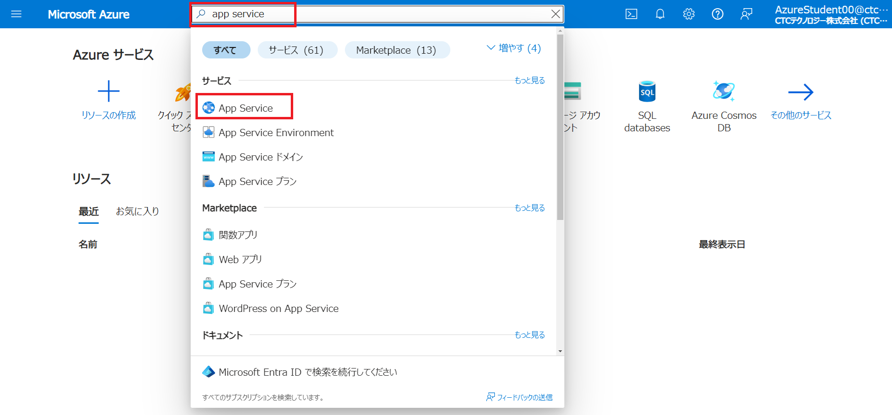
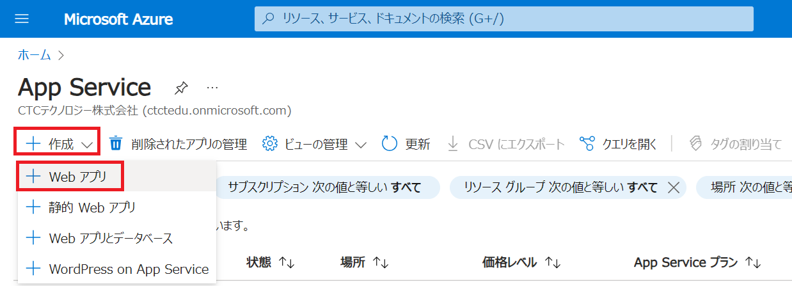
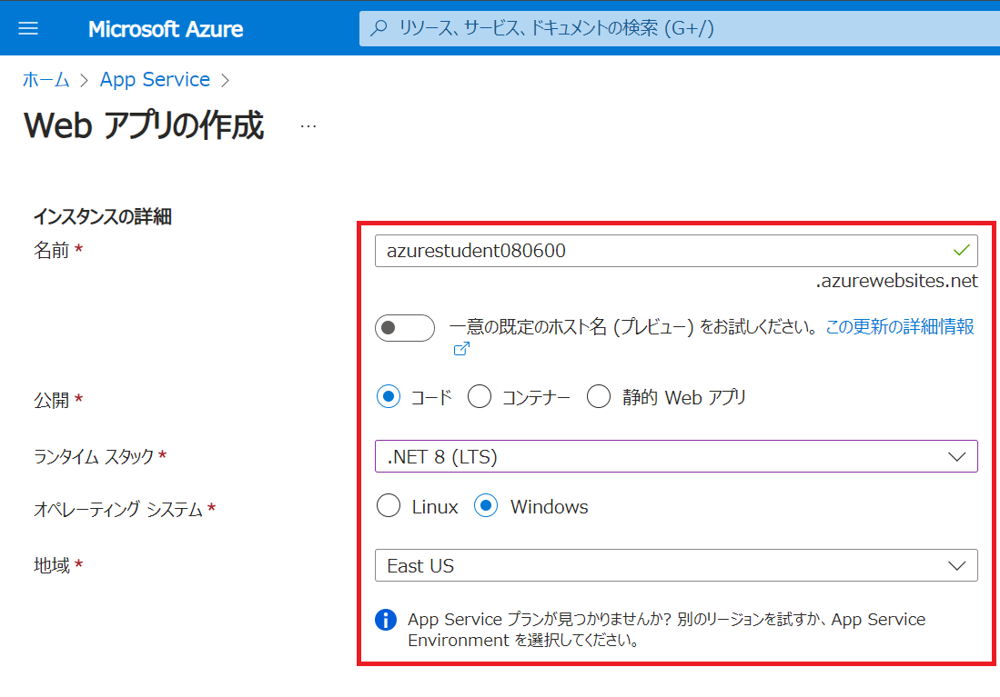
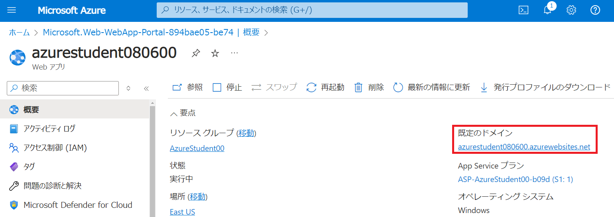
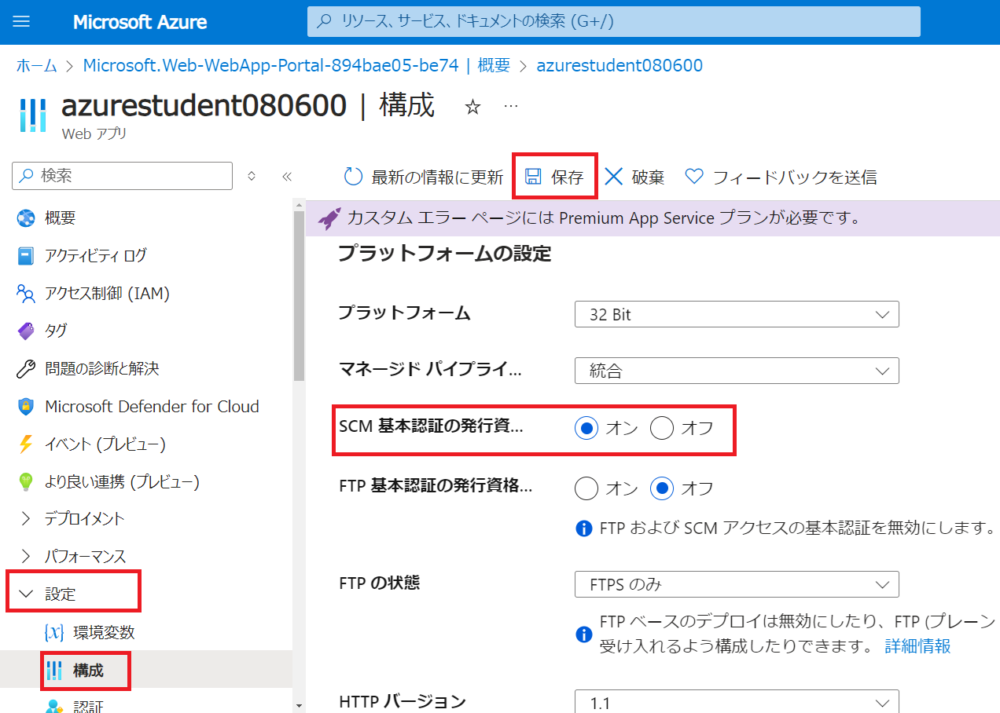
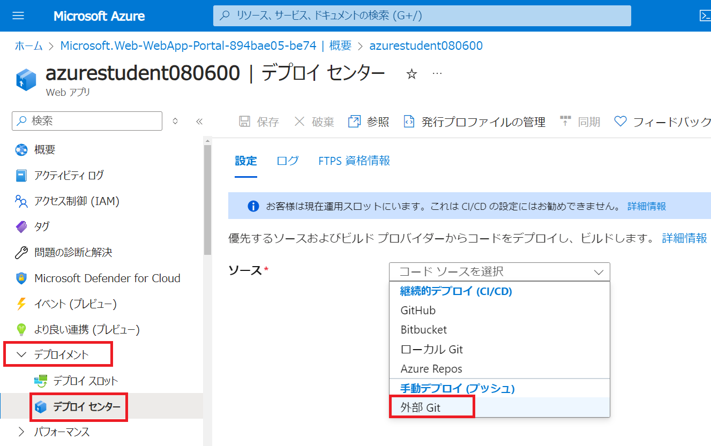
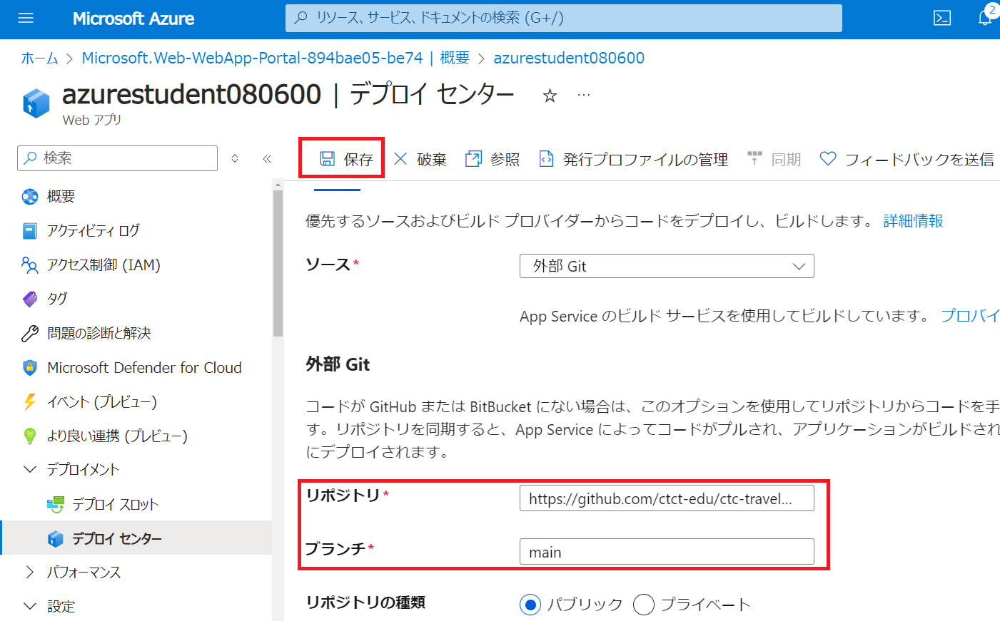

---
lab:
    title: 'Lab2 Webアプリを作成する	'
    learning path: '02'
    module: 'Module2 Azureのコアサービス'
---

# ラボ 02: Webアプリを作成する

## ラボ シナリオ

あなたの会社では、Azure上で新規にWebアプリを公開する予定です。Azure App Serviceを使い、Webページを公開します。

#### 推定時間: 15 分

## 演習 1 - Azure App Service から「Webアプリ」を作成

### タスク 1 - Webアプリを作成する

1. [https://portal.azure.com](https://portal.azure.com) に講師から指示された ID とパスワードでサインインします。

     | 設定       | 値                                         |
     | ---------- | ------------------------------------------ |
     | ユーザー名 | **azurestudent##@ctctedu.onmicrosoft.com** |
     | パスワード | Pa55w.rd1234                               |

     > 注：##は受講番号です。01 ～ 99の数字が入ります。

     

     

2. ポータルメニューの検索バーに「**app service**」と入力して検索結果を選択してください。

     

       

3. 画面左上の「**+作成**」のドロップダウンリストから「**Webアプリ**」を選択してください。

     

     

4. App Serviceの作成画面が表示されます。「**プロジェクトの詳細**」を入力します。

     | 設定               | 値                 |
     | ------------------ | ------------------ |
     | サブスクリプション | **従量課金**       |
     | リソースグループ   | **AzureStudent##** |

     > 注：##は受講番号です。01 ～ 99の数字が入ります。
     >
     > 注：リソースグループがない場合は、「新規作成」を選択し、作成します。

     

     

5. 「**インスタンスの詳細**」を入力します。

     | 設定               | 値                     |
     | ------------------ | ---------------------- |
     | 名前               | **azurestudent$$$$##** |
     | 公開               | **コード**             |
     | ランタイムスタック | **.NET 8(LTS)**        |
     | 地域               | **East US**            |

     > 注：$$$$は今日の日付4桁を入力します。 (例：2022年1月1日  ⇒ 0101)
     >
     > 注：##は受講番号です。01 ～ 99の数字が入ります。(例：azurestudent010101)
     >
     > 注："一意の既定のホスト名"がオンになっている場合はオフにします

     

     

6. 「**価格プラン**」は何も変更せず、「**確認および作成**」を選択します。

     

7. 「検証に成功しました」と表示されたら、画面左下部の「**作成**」を選択します。

     

     

8. 1分ほどでApp Serviceの作成が完了となります。

     

       

9. デプロイ完了後、「リソースに移動」を選択してください。

   
   
     

### タスク 2 - サンプルのWebページを確認する

1. App Serviceブレードの画面右にある「**既定のドメイン**」をクリックします。

   

   

2. サンプルのページが表示されます。

   
   
   

### タスク 3 - Webアプリを実装する

1. App Serviceブレードの左側にある**設定**項目を展開し、「**構成**」を選択して「**SCM基本認証の発行資格情報**」をオンにします。
    設定の変更を適用するため、必ず **「保存」** をクリックして続行してください。
    
    

   

2. 同じく画面左側の**デプロイメント**を展開し、 **「デプロイセンター」** を選択します。コードソースを選択のドロップダウンリストから **「外部Git」** を選択します。

   

   

3. 外部Gitの設定として以下の内容を入力します。
   入力後は設定の変更を適用するため、必ず **「保存」** をクリックして続行してください。

   | 設定       | 値                                                    |
   | ---------- | ----------------------------------------------------- |
   | リポジトリ | **https://github.com/ctct-edu/ctc-travel-agency.git** |
   | ブランチ   | **main**                                              |

   

     

### タスク 4 - 更新されたWebページを確認する

1. App Serviceブレードに戻り、画面右にある「**URL**」をクリックします。

   

   

2. サンプルのページが表示されます。

これでApp Serivceを使い、Webページを公開することが出来ました。

演習は終了です。お疲れ様でした。
