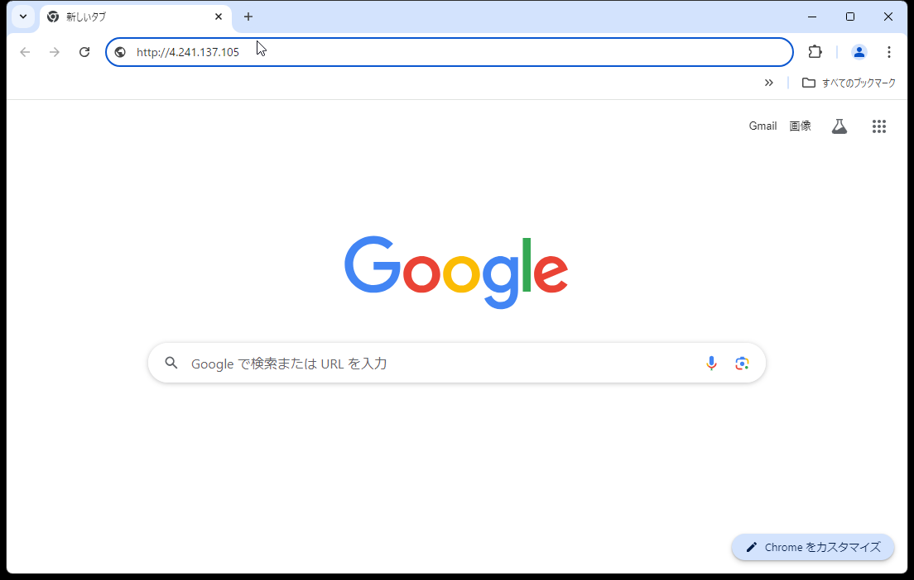
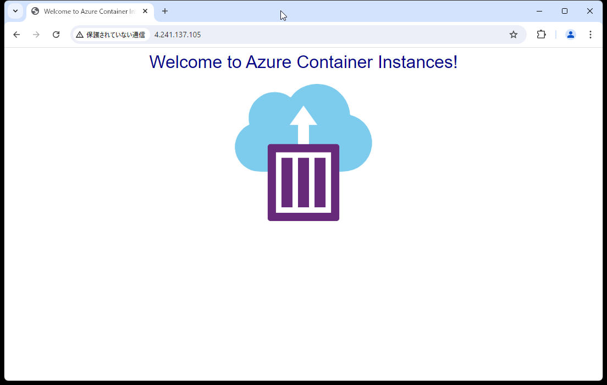

---
lab:
    title: 'Lab2 Webアプリを作成する	'
    learning path: '02'
    module: 'Module2 Azureのコアサービス'
---

# ラボ 02: Webアプリを作成する

## ラボ シナリオ

あなたの会社では、Azure上で新規にWebアプリを公開する予定です。Azure App Serviceを使い、Webページを公開します。

#### 推定時間: 10分

## 演習 1 -Container Instanceから「Webアプリ」を作成

### タスク 1 - Webアプリを作成する

1. Azure portal　([https://portal.azure.com](https://portal.azure.com))にサインインします。

2. Azure portalで「**コンテナー インスタンス**」を検索して選択し、「**+ 作成**」をクリックします。 

3. 「**基本**」タブで、次の情報を入力し、「確認および作成」をクリックします (その他の情報は既定値のままにします)。  

     | 設定               | 値                                            |
     | ------------------ | --------------------------------------------- |
     | サブスクリプション | **従量課金**                                  |
     | リソース グループ  | **AzureStudent##**                            |
     | コンテナー名       | **ctcteducontainer##**                        |
     | 地域               | **(Asia Pacific) Japan East もしくは 東日本** |

     

4. **「作成」** をクリックし作成後に**「リソースに移動」**をクリックします。

#### タスク 2 - Webアプリにアクセスする

1. コンテナーインスタンスブレードでIPアドレスをコピーします。

   

   

2. Webブラウザで「http://コピーしたIPアドレス」でアクセスします。

   

   

3. 「**Welcome to Azure Container Instances!**」というサンプルのWebページが表示されます。

   

   

これでコンテナーインスタンスを使い、Webページを公開することが出来ました。

演習は終了です。お疲れ様でした。
