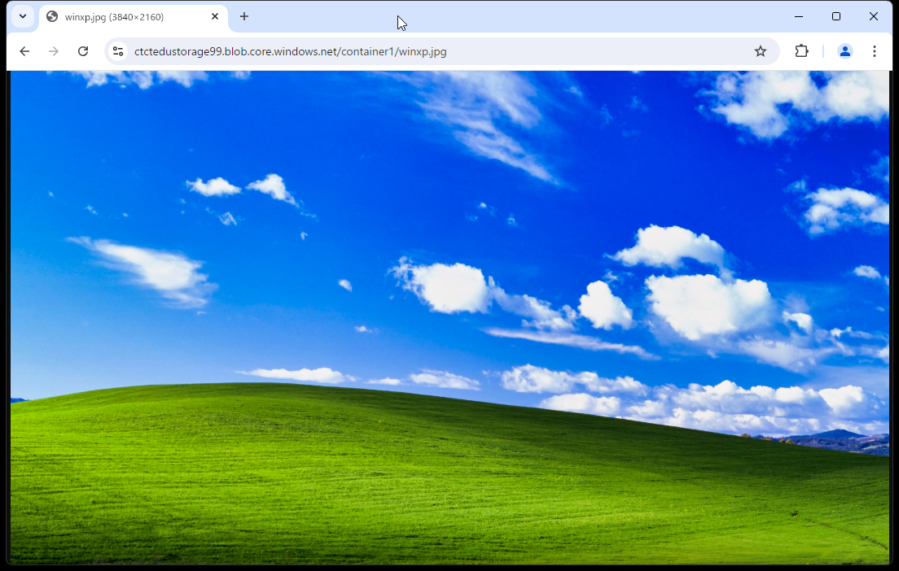

---
lab:
    title: 'ストレージアカウントを作成する'
    learning path: '04'
    module: 'Module2 Azureのコアサービス'
---

# ラボ 04：ストレージアカウントを作成する

## ラボ シナリオ

あなたの会社ではストレージアカウントを構築し、BLOBおよびファイル共有のサービスを展開します。

#### 推定時間: 40 分

### タスク 1 - ストレージ アカウントを作成

1. Azure portalで「**ストレージ アカウント**」を検索して選択し、**「+ 作成」** をクリックします。 

2. 「**ストレージ アカウントの作成**」 ブレードの 「**基本**」 タブで次の情報を入力し、「次へ」をクリックします。

    | 設定 | 値 |
    | --- | --- |
    | サブスクリプション | **従量課金** |
    | リソース グループ | **AzureStudent##**                            |
    | ストレージ アカウント名 | **ctctedustorage##**                          |
    | 地域 | **(Asia Pacific) Japan East もしくは 東日本** |
    | プライマリサービス      | **未選択**                                    |
    | パフォーマンス          | **Standard**                                  |
    | 冗長性 | **ローカル冗長ストレージ (LRS)** |

    

3. 「**詳細**」 タブの**「個々のコンテナーでの匿名アクセスの有効化を許可する」**にチェックを入れます。 

    

4. **「確認および作成」**  をクリックして、さらに **「作成」** をクリックします。

5. 作成後に**「リソースに移動」**をクリックし作成したストレージ アカウントに移動します。 

### タスク 2 - BLOBにファイルをアップロードする

1. **「ストレージ アカウント」** ブレードで、左側のメニューの「**データ ストレージ**」セクションから「**コンテナー**」をクリックします。

   

   

2. **「+ コンテナー」** をクリックして、 **「新しいコンテナー」**  ブレードで以下の情報を設定します。完了したら、 **「作成」** をクリックします。

   | 設定                 | 値                                         |
   | -------------------- | ------------------------------------------ |
   | 名前                 | **container1**                             |
   | 匿名 アクセス レベル | **BLOB（BLOB専用の匿名読み取りアクセス）** |

   

   

3. インターネットで好きな画像データを検索し、パソコンに保存します。

   > 注：ここでは、アップロードするための画像を探して保存してください。

4. Azure portalに戻り、**「container1」** をクリックします。

5. **「アップロード」**をクリックし、パソコンに保存した画像ファイルを選択し、「**アップロード**」 をクリックします。

   

   

6. アップロードされた**データをクリック**し、 **「概要」** ブレードにあるURLをコピーします。

   

7. 新しいブラウザー ウィンドウを開き、前の手順でコピーしたURLへアクセスします。

8. アップロードした画像が表示されることが確認できます。

   

   

### タスク 3 - ファイル共有を構成する

1. ストレージ アカウント ブレードに戻り、左側のメニューの「**データ ストレージ**」セクションから「**ファイル共有**」をクリックします。

    

    

2. **「+ ファイル共有」** をクリックします。

3. 「**基本**」タブで、名前に「share」と入力し、「次へ：バックアップ」をクリックします (その他の情報は既定値のままにします)。

    

    

4. 「**バックアップ**」タブで、「バックアップの有効化」の✅を外し、**「確認および作成」**をクリックします。

    

    

5. 「作成」をクリックします。

6. 作成されたファイル共有にて**「接続」**をクリックします。

    

    

7. **「接続」**画面で**「ドライブ文字」**を**「Z」**に指定し、**「スクリプトの表示」**をクリックします。

    

    

8. 表示されたスクリプトをコピーし、メモ帳に貼り付けます。

    > 注：コピーしたスクリプトは、ファイル共有をWindows OSでマウントするためのコマンドです。

### タスク 4 - 仮想マシンにファイル共有をマウントする

> 注：前の演習で作成した仮想マシン「**Server##-1**」を使用します。

1. Azure portalで「**Virtual Machines**」を検索して選択します。

2. 「**Virtual Machines**」 ブレードで**Server##-1** をクリックします。

3. 「**ネイティブRDP**」の項目で「**選択**」のボタンをクリックし、表示されたメニューから「**RDP ファイルのダウンロード**」をクリックしてください。

4. ダウンロードした RDP ファイルをクリックし、Windows 認証を行いサインインしてください。
   ※証明書に関する警告が表示された場合は「はい」をクリックしてください

   | **設定**   | **値**              |
   | :--------- | :------------------ |
   | ユーザー名 | **admsv**           |
   | パスワード | **Pa55w.rdabc1234** |

   

5. RDP接続先のマシンにて、スタートメニューから「**Powershell**」を起動します。

   

   

6. 起動した Powershell でコピーしたスクリプトを貼り付け、実行します。

   

   

7. 実行結果に「CMDKEY: Credential added successfully.」と表示されれば成功です。

8. スタートメニューから「ファイル エクスプローラー」をクリックします。

   

   

9. 「This PC」をクリックし、作成したファイル共有「share」が表示されたことを確認します。

これでストレージアカウントのBLOBとファイル共有を構築しました。

演習は終了です。お疲れ様でした。

