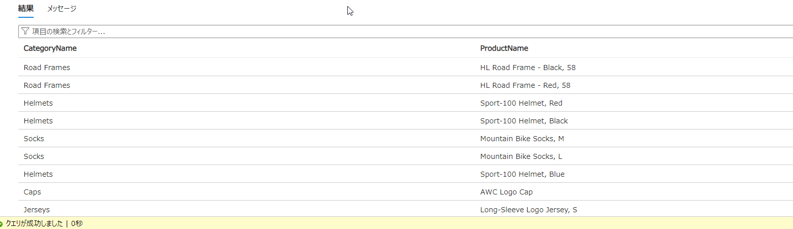

---
lab:
    title: 'Azure SQL Databaseを作成する'
    learning path: '05'
    module: 'Module2 Azureのコアサービス'
---

# ラボ 05：Azure SQL Databaseを作成する

## ラボ シナリオ

あなたの会社ではAzure SQL Databaseを作成します。


#### 推定時間: 30 分

### タスク 1 - Azure SQL Databaseを作成

1. Azure portalで「**SQL データベース**」を検索して選択し、**「+ 作成」** をクリックします。 

2. 「**SQL データベースの作成**」 ブレードの 「**基本**」 タブで次の情報を入力します。

    | 設定 | 値 |
    | --- | --- |
    | サブスクリプション | **Microsoft Azure スポンサー プラン** |
    | リソース グループ | **AzureStudent1##**                           |
    | データベース名 | **testdb##**             |

    

3. 「**サーバー**」項目で「新規作成」をクリックします。

4. 「サーバーの詳細」画面で次の情報を入力し「OK」をクリックします。

    | 設定                   | 値                                            |
    | ---------------------- | --------------------------------------------- |
    | サーバー名             | **ctcttestdbsv##**                            |
    | 場所                   | **(Asia Pacific) Japan East もしくは 東日本** |
    | 認証方法               | **SQL認証を使用する**                         |
    | サーバー管理者ログイン | **dbadmin**                                   |
    | パスワード             | **Pa55w.rdabc1234**                           |

    

5. **「ワークロード環境」**項目は**「開発」**に変更します。

6. **「バックアップ ストレージの冗長性」**項目は**「ローカル冗長バックアップストレージ」**を選択します。

    

7. **「次：ネットワーク」**をクリックします。

8. **「ネットワーク」** タブで次の情報を設定し、**「次：セキュリティ」**をクリックします。

    | 設定                                   | 値                         |
    | -------------------------------------- | -------------------------- |
    | 接続方法                               | **パブリックネットワーク** |
    | 現在のクライアントIPアドレスを追加する | **はい**                   |

    

9. **「セキュリティ」** タブは何も変更せずに、**「次：追加設定」**をクリックします。

10. **「追加設定」** タブは「**既存のデータを使用します**」にて「**サンプル**」を選択します。続行するかの確認が表示された場合は **「OK」** をクリックします。

    

11. **「確認および作成」**  をクリックして、さらに **「作成」** をクリックします。

12. 作成後に**「リソースに移動」**をクリックし作成したSQLデータベースに移動します。 


### タスク 2 - Azure SQL Databaseでクエリを実行する

1. **「SQLデータベース」** ブレードで、左側のメニューの「**クエリエディター**」をクリックします。

2. 以下のユーザー名とパスワードを用いてログインします。

   | 設定       | 値                  |
   | ---------- | ------------------- |
   | ログイン   | **dbadmin**         |
   | パスワード | **Pa55w.rdabc1234** |

   

3. 画面中央にあるクエリ入力画面に以下のクエリを入力し、「実行」します。

   ```sql
   SELECT TOP 20 pc.Name as CategoryName, p.name as ProductName
   FROM SalesLT.ProductCategory pc
   JOIN SalesLT.Product p
   ON pc.productcategoryid = p.productcategoryid;
   ```

   

4. 結果に値が出てくれば成功です。



これでSQLデータベースを構築しました。

演習は終了です。お疲れ様でした。
