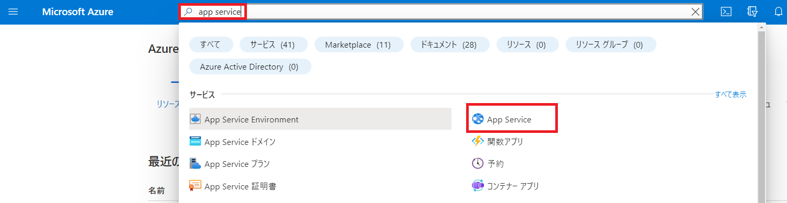
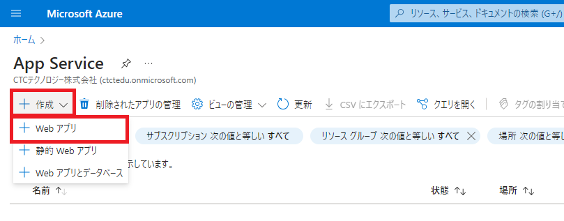
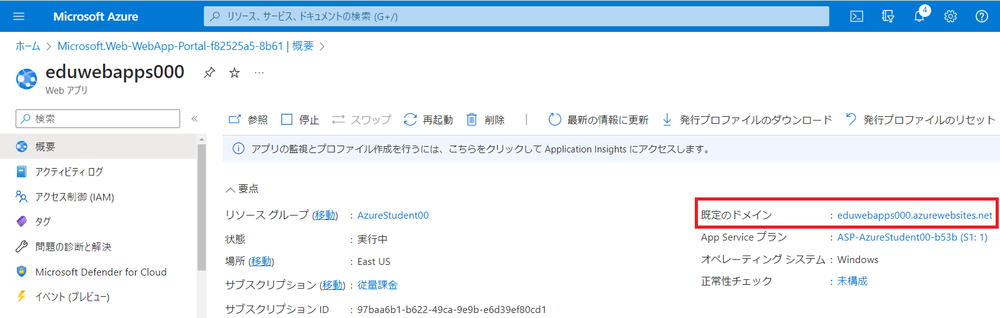
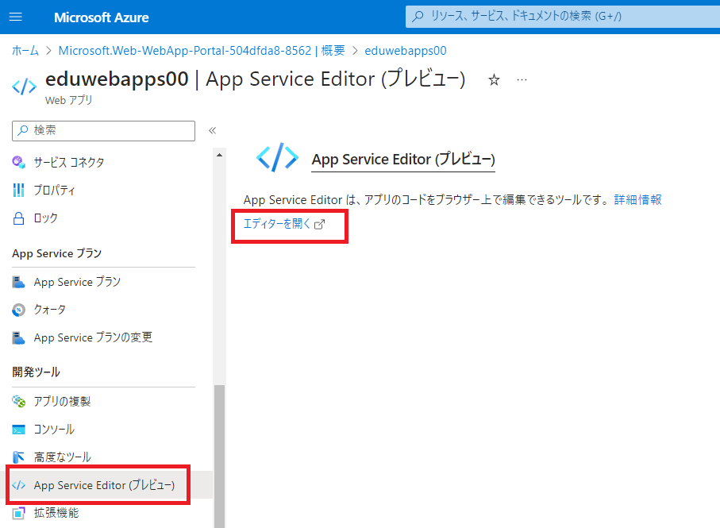

---
lab:
    title: 'Lab2 Webアプリを作成する	'
    learning path: '02'
    module: 'Module2 Azureのコアサービス'
---

# ラボ 02: Webアプリを作成する(15分)

## ラボ シナリオ

あなたの会社では、Azure上で新規にWebアプリを公開する予定です。Azure App Serviceを使い、Webページを公開します。

## 演習 1 - Azure App Service から「Webアプリ」を作成

### タスク 1 - Webアプリを作成する

1. Azure portal　([https://portal.azure.com](https://portal.azure.com)) にサインインし、講師から指示された ID とパスワードでサインインします。

     
   
2. Azure portalで「**app service**」と入力して検索結果を選択してください。

     

       

3. 画面左上の「**+作成**」のドロップダウンリストから「**Webアプリ**」を選択してください。

     

     

4. App Serviceの作成画面が表示されます。 **「プロジェクトの詳細」** を設定します。

     | 設定               | 値                                                           |
     | ------------------ | ------------------------------------------------------------ |
     | サブスクリプション | **Microsoft Azure スポンサー プラン**                        |
     | リソースグループ   | **アカウントのリソースグループをプルダウンから選択(新規作成はできません)** |

     
     
5.  **「インスタンスの詳細」** を設定します。

    | 設定                                                 | 値                          |
    | ---------------------------------------------------- | --------------------------- |
    | 名前                                                 | **eduwebappsXX**            |
    | 一意の既定のホスト名（プレビュー）をお試しください。 | **オフ** （ボタンを非活性） |
    | 公開                                                 | **コード**                  |
    | ランタイムスタック                                   | **.NET 8(LTS)**             |
    | オペレーティングシステム                             | **Windows**                 |
    | 地域                                                 | **East US**                 |
    
     > 注：名前のXXは講師から指示がある演習番号を使用してください (例 : 演習番号01の人 ⇒ eduwebapps01)。 
     >
    
     
    
6. 「**価格プラン**」は何も変更せず、「**確認および作成**」を選択します。

     

7. 検証が完了したら、画面左下部の「**作成**」を選択します。

     

8. 1分ほどでApp Serviceの作成が完了となります。

     

       

9. デプロイ完了後、「**リソースに移動**」を選択してください。

   
   
     


### タスク 2 - サンプルのWebページを確認する

1. App Serviceブレードの画面右にある「**既定のドメイン**」をクリックします。

   

   

2. サンプルのページが表示されます。

   
   
   

### タスク 3 - Webアプリを実装する

1. Azure ポータルに戻り、App Serviceブレードの左側にある **「開発ツール」** セクションの **「App Service Editor(プレビュー)」** を選択し **「エディターを開く」** を選択します。




2. エディタが表示されます。「**hostingstart.html**」を**右クリック**し「**Delete**」を選択し削除します。

   
   
   

5. 画面左側にある「**Git**」アイコンを選択します。

   
   
   
   
5. 「**Repository URL**」に以下のURLを入力し「**Clone from a git URL**」を選択します。

   ```
   https://github.com/ctct-edu/ctc-travel-agency.git
   ```
   
   > 注：このURLは「Github」上に公開しているサンプルのリポジトリになります。
   >
   > 　　GitHub上にあるWebアプリのデータを自分のApp Service上にコピーし実装することが可能です。
   >
   > 　　試しにURLにアクセスすると、GitHubのページが表示されます。
   
   
   
   
   
5. リポジトリがコピーされました。画面右側の最終行で「**remote : Tolal ～**」と表示されます。

   
   
     

### タスク 4 - 更新されたWebページを確認する

1. App Serviceブレードに戻り、画面右にある「**URL**」をクリックします。

   

   

2. サンプルのページが表示されます。


これでApp Serivceを使い、Webページを公開することが出来ました。

**注**: 追加コストを回避するために、作成したリソースを削除できます。

1. Azure ポータル上部にある検索ボックスで **「リソースグループ」** を検索します。

2. 検索結果より、演習で使用しているリソースグループ名をクリックします。

3. リソースグループの **「概要」** ブレード内にある、リソースの一覧から削除したいリソースを選択し、 **「削除」** をクリックします。

4. **「リソース削除」** ブレードで **「削除の確認」** ボックス内に **「はい」** と入力してから **「削除」** をクリックします。

5. リソースがすべて削除されるまでに数分かかります。削除されるのを待たずに次に演習に進んで構いません。

   **※注意※リソースグループそのものを削除すると、演習ができなくなります。削除する時は、リソースグループ内のリソースのみにしてください。**
